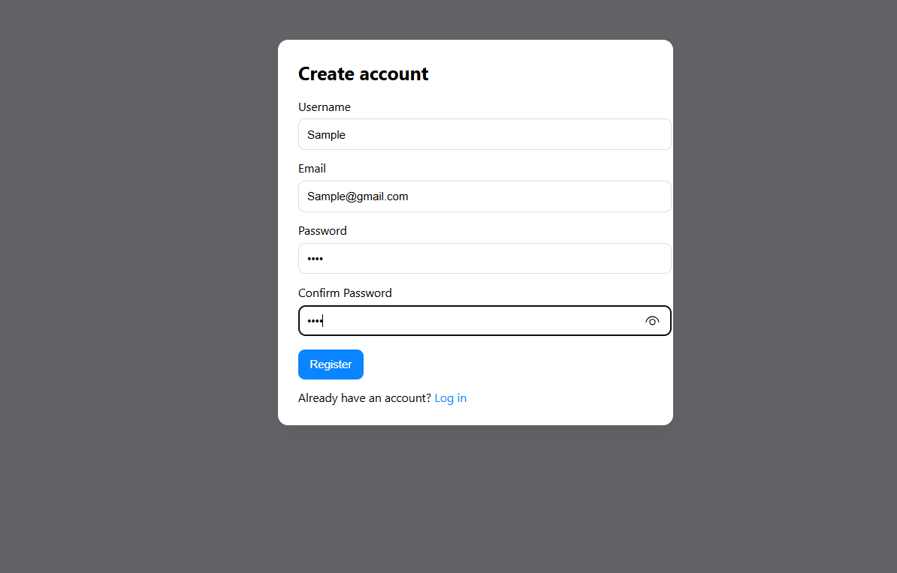

# Flask Authentication App

A simple and secure **Flask web application** that provides user authentication with registration, login, logout, and account deletion functionality.  
Passwords are securely hashed using Werkzeug for safe storage.

## Features

- Register new users with a unique username and email.
- Log in securely with password hashing.
- Access a protected dashboard page (only for logged-in users).
- Log out to end session securely.
- Delete account manually if the user chooses.
- Lightweight and beginner-friendly project.

## Technologies Used

- **Python (Flask)**: Web framework for building the app.
- **Flask-SQLAlchemy**: Database ORM for managing users.
- **SQLite**: Lightweight database for storing users.
- **Werkzeug**: Provides password hashing for security.
- **HTML + Bootstrap**: For frontend templates.

### Registration Page


### Login Page


### Dashboard


### Delete Account


## Installation

1. Clone the repository:
   ```bash
   git clone https://github.com/your-username/flask-auth-app.git

## Navigate to the project directory: 

   cd Flask-app

## Create a virtual environment:

   python -m venv env

## Activate the environment:
  
  Windows: env\Scripts\activate
  MacOS: source env/bin/activate

## Install dependencies:
   
   pip install -r requirements.txt

## Run the application:
   
   python app.py

## 📂 Project Structure

flask-auth-app/
│  app.py
│  requirements.txt
│  README.md
|  images/
   | dashboard.png
   | login.png
   | register.png
└─ templates/
   │  base.html
   │  register.html
   │  login.html
   │  dashboard.html

## ⭐ Show Some Love!
If you like this project, **give it a star ⭐** and share it with your friends! 😊
